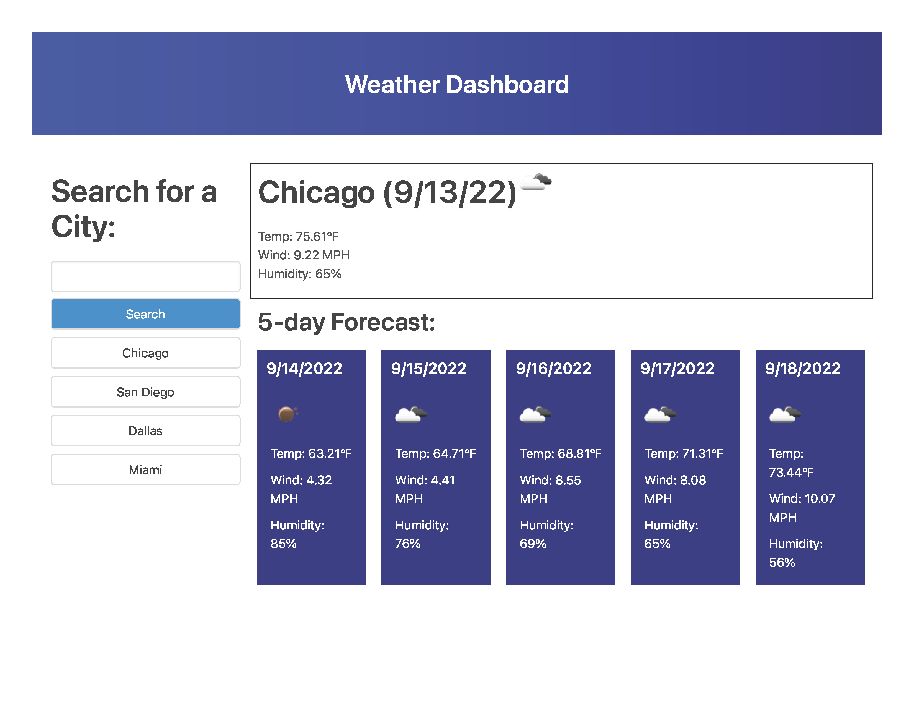

# Weather-dashboard-challenge-6

## Description
This is the sixth challenge in the Northwestern Coding Bootcamp (Module 6). We were required to create a weather dashboard that uses the Open Weather API. We had to fetch data from the API and present it on the page for the current time, as well as the 5-day forecast. In addition, we had to allow the user to click on previously searched cities to easily view those forecasts as well. I also added the "search history" to local storage so you can view this information if the user refreshed the page or left and returned at a later time.

For this assignment, our instructor asked us to use the city url and display the data by api url. In addition, the UV index is not available in the free version, and the lat and lon values are not working either, so neither of those are present on the webpage.

## Link to live page
[Live Link](https://mbronstein1.github.io/Weather-Dashboard-Challenge-6/)

## Screenshot


## User Story

```
AS A traveler
I WANT to see the weather outlook for multiple cities
SO THAT I can plan a trip accordingly
```

## Acceptance Criteria

```
GIVEN a weather dashboard with form inputs
WHEN I search for a city
THEN I am presented with current and future conditions for that city and that city is added to the search history
WHEN I view current weather conditions for that city
THEN I am presented with the city name, the date, an icon representation of weather conditions, the temperature, the humidity, the wind speed, and the UV index
WHEN I view the UV index
THEN I am presented with a color that indicates whether the conditions are favorable, moderate, or severe
WHEN I view future weather conditions for that city
THEN I am presented with a 5-day forecast that displays the date, an icon representation of weather conditions, the temperature, the wind speed, and the humidity
WHEN I click on a city in the search history
THEN I am again presented with current and future conditions for that city
```